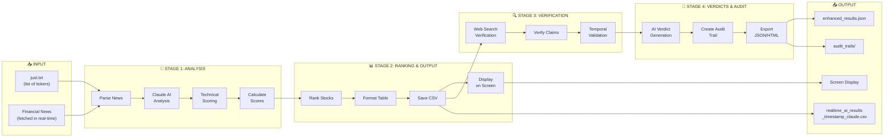
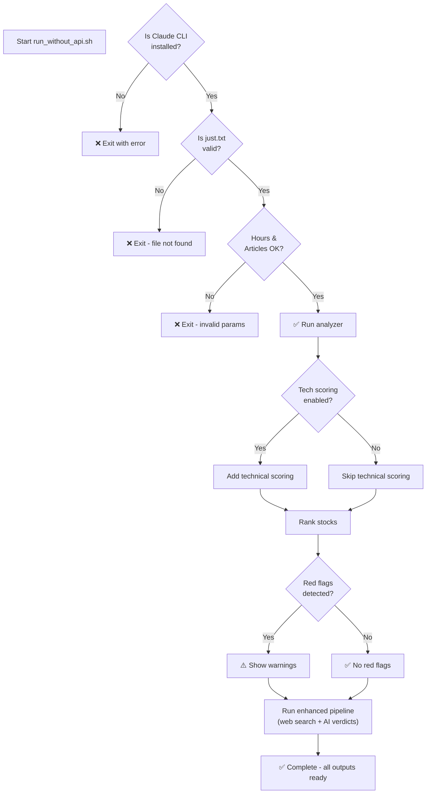

# Pipeline Flow Diagram

## Command Execution Flow

```
./run_without_api.sh claude just.txt 8 10 1
                     │      │        │  │  └─ Enable Technical Scoring (optional)
                     │      │        │  └──── Max Articles per stock (10)
                     │      │        └─────── Hours back (8 hours)
                     │      └──────────────── Tickers file (just.txt)
                     └──────────────────────── AI Provider (claude)
```

---

## Complete Execution Flow (Mermaid Diagram)

```mermaid
flowchart TD
    Start["🚀 START: ./run_without_api.sh claude just.txt 8 10 1"]
    Start --> ParseArgs["📝 Parse Arguments<br/>Provider: claude<br/>Tickers: just.txt<br/>Hours: 8<br/>Max Articles: 10<br/>Tech Scoring: 1"]

    ParseArgs --> CheckClaude{"✅ Check Claude<br/>CLI Available?"}
    CheckClaude -->|No| Error1["❌ ERROR<br/>Claude CLI not found<br/>Install with: npm install -g @anthropic-ai/claude-code"]
    Error1 --> End1["❌ EXIT"]

    CheckClaude -->|Yes| SetEnv["⚙️ Set Environment Variables<br/>CLAUDE_SHELL_CMD=python3 claude_cli_bridge.py<br/>AI_PROVIDER=claude<br/>ENABLE_TECHNICAL_SCORING=1<br/>AI_STRICT_CONTEXT=1"]

    SetEnv --> RunAnalyzer["🔄 RUN: realtime_ai_news_analyzer.py<br/>--tickers-file just.txt<br/>--hours-back 8<br/>--max-articles 10<br/>--ai-provider claude<br/>--verify-internet<br/>--probe-agent<br/>--disable-ticker-validation"]

    RunAnalyzer --> FetchNews["🌐 FETCH NEWS<br/>From financial sources<br/>Last 8 hours<br/>Max 10 articles/ticker"]

    FetchNews --> ParseNews["📰 PARSE NEWS<br/>Extract:<br/>- Ticker symbol<br/>- Title<br/>- Source<br/>- Time<br/>- Content"]

    ParseNews --> AnalyzeNews["🤖 AI ANALYSIS (CLAUDE)<br/>For each news item:<br/>- Sentiment: Bullish/Bearish<br/>- Catalysts: What's driving it<br/>- Risk factors<br/>- Quant Alpha score<br/>- Recommendation"]

    AnalyzeNews --> TechScore{"📊 Technical Scoring<br/>Enabled?<br/>(5th arg = 1)"}

    TechScore -->|Yes| TechAnalysis["📈 TECHNICAL ANALYSIS<br/>RSI, Bollinger Bands<br/>ATR, Volume, Momentum<br/>Consolidation detection<br/>Break signals"]

    TechScore -->|No| SkipTech["⏭️ Skip Technical"]

    TechAnalysis --> CalcTech["🔢 Calculate Hybrid Score<br/>60% News Score<br/>+ 40% Technical Score"]

    SkipTech --> CalcScore["🔢 Calculate Combined Score<br/>Sentiment boost/penalty<br/>+ Event type bonus<br/>+ Source credibility<br/>+ FII/DII cues<br/>+ Profit growth factor"]

    CalcTech --> RankStocks["🏆 RANK STOCKS<br/>Sort by adj_score<br/>Highest first<br/>Apply ranking logic<br/>Check for red flags:<br/>- Negative quarterly growth<br/>- Negative networth"]

    CalcScore --> RankStocks

    RankStocks --> DisplayLive["📊 DISPLAY LIVE RANKINGS<br/>Show top 10 during analysis<br/>Real-time updates"]

    DisplayLive --> SaveCSV["💾 SAVE CSV<br/>Filename: realtime_ai_results_<br/>YYYY-MM-DD_HH-MM-SS_<br/>claude.csv<br/><br/>Columns:<br/>- ticker<br/>- company_name<br/>- combined_score<br/>- adj_score<br/>- articles<br/>- dups<br/>- reason<br/>- event_type<br/>- top_title<br/>- top_source"]

    SaveCSV --> PrintTable["🎯 PRINT FINAL TABLE<br/>═════════════════<br/>📊 FINAL RANKINGS - TOP STOCKS<br/>═════════════════<br/>Rank│Ticker│Score│Adj│Articles│Reason<br/>─────────────────<br/>1    │SBIN  │75.32│75.32│5       │Results/metrics<br/>2    │REL   │82.18│82.18│8       │M&A/JV; Reuters<br/>3    │ABC   │68.05│68.05│3       │⚠️ NEGATIVE GROWTH<br/>...<br/>─────────────────<br/>✅ Top 25 of 45 analyzed<br/>⚠️ 2 red flags detected"]

    PrintTable --> CopyCSV["📋 COPY TO CANONICAL NAME<br/>realtime_ai_results.csv<br/>realtime_ai_results_rejected.csv"]

    CopyCSV --> QuickView["📊 QUICK VIEW (in bash)<br/>Top 10 preview:<br/>SBIN       │ Score: 75.32  │ Articles: 5<br/>RELIANCE   │ Score: 82.18  │ Articles: 8<br/>...<br/>💾 Full file: realtime_ai_results_2025-11-15_02-32-37_claude.csv"]

    QuickView --> EnhancedStart["🚀 START ENHANCED PIPELINE"]

    EnhancedStart --> WebSearch["🔍 WEB SEARCH VERIFICATION<br/>For each stock:<br/>- Verify earnings claims<br/>- Check analyst targets<br/>- Verify FII/DII holdings<br/>- Confirm contract orders<br/>- Real-time web search"]

    WebSearch --> BuildVerified["✅ BUILD VERIFICATION RESULTS<br/>For each claim:<br/>- Claimed value<br/>- Verified value<br/>- Verification status<br/>- Confidence %<br/>- Sources<br/>- Publication dates"]

    BuildVerified --> TemporalCheck["⏰ TEMPORAL VALIDATION<br/>Check data freshness:<br/>- Earnings data ≤7 days old?<br/>- Analyst targets ≤90 days?<br/>- FII/DII data ≤24 hours?<br/>- Price data ≤72 hours?<br/>Detect temporal conflicts"]

    TemporalCheck --> AIVerdict["🤖 AI VERDICT (CLAUDE)<br/>Generate verdict based ONLY on:<br/>- Verified data points<br/>- Current prices (yfinance)<br/>- Recent news (verified)<br/>- Real-time FII/DII<br/>- Official company results<br/><br/>⚠️ EXCLUDE from reasoning:<br/>- Training data<br/>- Memorized prices<br/>- Historical patterns<br/>- Pre-existing opinions"]

    AIVerdict --> CreateAudit["📋 CREATE AUDIT TRAIL<br/>Log everything:<br/>- Each data point<br/>- Verification status<br/>- Sources used<br/>- Confidence scores<br/>- Decisions made<br/>- Timestamps"]

    CreateAudit --> ExportFormats["📁 EXPORT IN 3 FORMATS<br/>1. CSV: Spreadsheet-friendly<br/>2. JSON: Machine-readable<br/>3. HTML: Browser-viewable"]

    ExportFormats --> GenerateReport["📊 GENERATE FINAL REPORT<br/>enhanced_results/enhanced_results.json<br/><br/>Contains:<br/>- Original analysis<br/>- Web search verification<br/>- Temporal validation<br/>- AI verdicts<br/>- Audit trails<br/>- Recommendations"]

    GenerateReport --> FinalSummary["✅ FINAL SUMMARY PRINTED<br/>📊 Results:<br/>  Original:  realtime_ai_results_2025-11-15_02-32-37_claude.csv<br/>  Enhanced:  enhanced_results/enhanced_results.json<br/>  Audits:    audit_trails/*/<br/><br/>💡 Try Claude for better accuracy:<br/>   ./run_without_api.sh claude just.txt 8 10"]

    FinalSummary --> Success["✅ COMPLETE - ALL OUTPUTS READY"]
    Success --> End2["🎉 DONE"]
```



---

## Data Flow Diagram



---

## Detailed Stage Breakdown

### 📥 STAGE 1: NEWS ANALYSIS

```
Input: just.txt (8 tickers), Last 8 hours, Max 10 articles

For EACH ticker:
  1. Fetch news from financial sources (Reuters, ET, Mint, etc.)
  2. Parse each article:
     - Extract title, source, timestamp, content
  3. For EACH news item:
     - Claude AI analyzes:
       * Sentiment (Bullish/Bearish/Neutral)
       * Catalysts (What's driving movement)
       * Risk factors
       * Quant Alpha
       * Recommendation (BUY/HOLD/SELL)
  4. Optional: Technical scoring
     - RSI, Bollinger Bands, ATR
     - Volume analysis
     - Momentum indicators
     - Consolidation detection
  5. Calculate combined score:
     - News sentiment
     - Event type (Results, M&A, etc.)
     - Source credibility
     - FII/DII cues
     - Profit growth factor
     - RED FLAG CHECKS:
       * Negative quarterly growth? ⚠️
       * Negative networth? ⚠️
  6. RANK by combined score
  7. SAVE to CSV

Output: realtime_ai_results_TIMESTAMP_claude.csv
```

### 📊 STAGE 2: DISPLAY & FORMATTING

```
Input: realtime_ai_results_TIMESTAMP_claude.csv

1. Read CSV file
2. Format as readable table:
   Rank │ Ticker │ Combined │ Adjusted │ Articles │ Reason
   ─────┼────────┼──────────┼──────────┼──────────┼────────────────
   1    │ SBIN   │ 75.32    │ 75.32    │ 5        │ Results/metrics
   2    │ REL    │ 82.18    │ 82.18    │ 8        │ M&A/JV; Reuters
   3    │ ABC    │ 68.05    │ 68.05    │ 3        │ ⚠️ NEGATIVE GROWTH
   ...

3. HIGHLIGHT red flags with ⚠️
4. COUNT red-flagged stocks
5. SHOW file locations
6. SUGGEST grep command for red flags

Output: Beautiful table on SCREEN
```

### 🔍 STAGE 3: VERIFICATION (WEB SEARCH)

```
Input: Stocks from CSV with news claims

For EACH stock:
  1. Web search verification:
     - Search for earnings claims
     - Verify analyst targets
     - Check FII/DII holdings
     - Confirm contract orders
  2. For EACH claim:
     - Claimed value (from news)
     - Verified value (from web search)
     - Confidence % (0-100)
     - Sources (where verified)
     - Publication dates
     - Status: VERIFIED/CONFLICTING/UNVERIFIED
  3. Check temporal freshness:
     - Earnings data ≤7 days old?
     - Analyst targets ≤90 days?
     - FII/DII data ≤24 hours?
     - Price data ≤72 hours?

Output: Verification results with confidence scores
```

### 🤖 STAGE 4: AI VERDICTS & AUDIT

```
Input: Verified data + temporal validation

For EACH stock:
  1. Generate AI verdict using CLAUDE:
     - Input: ONLY verified facts
     - Process: Analyze verified data
     - Output: Buy/Hold/Sell recommendation

     ⚠️ EXPLICIT INSTRUCTIONS TO CLAUDE:
     "DO NOT use training data, memorized prices, or pre-existing opinions.
      USE ONLY the verified facts provided below."

  2. Create audit trail:
     - Log each data point
     - Log verification status
     - Log sources used
     - Log AI decision reasoning
     - Timestamp everything

  3. Export in 3 formats:
     - CSV: For Excel analysis
     - JSON: For machine processing
     - HTML: For browser viewing

Output: enhanced_results.json + audit_trails/
```

---

## Key Decision Points



---

## Time Flow (Typical Execution)

```
Timeline for: ./run_without_api.sh claude just.txt 8 10 1
(8 tickers, max 10 articles each)

0:00  ├─ Start script
0:05  ├─ Check Claude CLI
0:10  ├─ Fetch news (8 hours back, ~80 articles)
0:20  ├─ AI analysis with Claude (~5s per article)
3:00  ├─ Technical scoring
3:15  ├─ Rank stocks & format results
3:20  ├─ Save CSV + Display table on screen ✨
3:25  ├─ Run enhanced pipeline (web search)
5:30  ├─ AI verdicts on verified data
5:45  ├─ Create audit trails
6:00  └─ ✅ COMPLETE

Total: ~6 minutes
```

---

## File Outputs

```
After execution, you'll have:

1. 📊 Original Results CSV:
   realtime_ai_results_2025-11-15_02-32-37_claude.csv
   └─ Columns: ticker, combined_score, adj_score, reason, event_type, etc.

2. 📋 Quick Copy:
   realtime_ai_results.csv
   └─ Same as above (for convenience)

3. 📁 Rejected Stocks Log:
   realtime_ai_results_rejected.csv
   └─ Stocks filtered out (why and what failed)

4. 🔍 Enhanced Results with Verification:
   enhanced_results/enhanced_results.json
   └─ Original analysis + web search verification + AI verdicts

5. 📋 Complete Audit Trail:
   audit_trails/
   ├─ audit_trail_TIMESTAMP_CSV.csv
   ├─ audit_trail_TIMESTAMP_JSON.json
   └─ audit_trail_TIMESTAMP_HTML.html

6. ✅ Console Output:
   - Live rankings (during analysis)
   - Final table (top 25)
   - Quick view (top 10)
   - Red flag warnings
   - File locations
```

---

## How to Read the Output

```
Rank  │ Ticker   │ Combined │ Adjusted │ Articles │ Reason
──────┼──────────┼──────────┼──────────┼──────────┼──────────────────────────────
1     │ SBIN     │ 75.32    │ 75.32    │ 5        │ Results/metrics; Reuters
      │          │          │          │          │
      │ ┌────────┴──────────┘ Score = Score with all adjustments applied
      │ │
      └─┴─ Rank by descending score (highest first)

Legend:
- Combined: Original AI news score (0-100)
- Adjusted: After all ranking factors applied
- Articles: How many news items analyzed
- Reason: WHY it got this score
  └─ Event type (Results, M&A, etc.)
  └─ Magnitude impact
  └─ Source quality
  └─ !!!RED FLAGS!!! if detected
```

---

## Summary

```
┌─────────────────────────────────────────────────────────────┐
│ Command: ./run_without_api.sh claude just.txt 8 10 1        │
└─────────────────────────────────────────────────────────────┘
                          ↓
              ┌───────────────────────┐
              │  1. NEWS ANALYSIS     │
              │  - Fetch news         │
              │  - AI sentiment       │
              │  - Tech scoring       │
              │  - Calculate scores   │
              └───────────────────────┘
                          ↓
              ┌───────────────────────┐
              │  2. RANKING OUTPUT    │ ← YOU SEE TABLE HERE
              │  - Sort stocks        │
              │  - Format table       │
              │  - Save CSV           │
              │  - Display on screen  │
              └───────────────────────┘
                          ↓
              ┌───────────────────────┐
              │  3. VERIFICATION      │
              │  - Web search         │
              │  - Verify claims      │
              │  - Temporal check     │
              └───────────────────────┘
                          ↓
              ┌───────────────────────┐
              │  4. AI VERDICTS       │
              │  - Generate verdicts  │
              │  - Create audit trail │
              │  - Export formats     │
              └───────────────────────┘
                          ↓
                  ✅ COMPLETE
           (All files ready to review)
```

