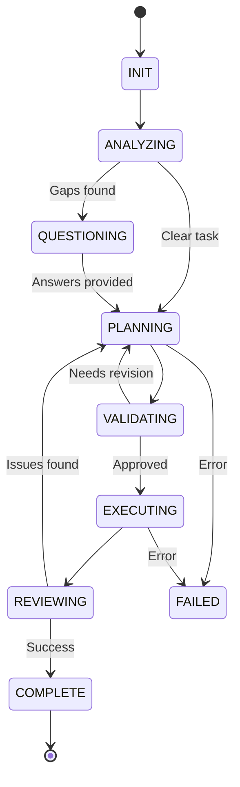

# CLI Planner AI - AI Coding Planner & Questioning Framework

A reusable AI-powered planning framework for any coding task. Features a clean state machine, strict JSON schemas, ranked question taxonomy, and ready-to-use system/user/critic prompts.

## 🎯 Overview

Based on the battle-tested patterns from `ref_code_cli_planner_ai/claude_cli_bridge.py`, this framework provides:

- **Clean State Machine**: INIT → ANALYZING → QUESTIONING → PLANNING → VALIDATING → EXECUTING → REVIEWING → COMPLETE
- **Strict JSON Schemas**: Type-safe plan and question structures
- **Ranked Question Taxonomy**: CRITICAL > HIGH > MEDIUM > LOW > OPTIONAL
- **Acceptance Tests**: Both bats and pytest test suites
- **Ready-to-Paste Prompts**: System, user, and critic prompts for each state
- **Worked Example**: Trivy pipeline integration case study

## 🏗️ Architecture

```
cli_planner_ai/
├── schemas.py              # JSON schemas & state machine
├── prompts.py              # System/user/critic prompts
├── cli_planner_bridge.py   # Main orchestration bridge
├── tests/
│   ├── test_planner.bats   # Acceptance tests (bats)
│   └── test_schemas.py     # Unit tests (pytest)
├── examples/
│   └── trivy_pipeline_example.sh
└── README.md               # This file
```

### State Machine



## 🚀 Quick Start

### Installation

```bash
cd /home/vagrant/R/cli_planner_ai

# Install dependencies
pip install anthropic  # If using Anthropic API
# OR ensure Claude CLI is installed and authenticated
claude --version

# Verify installation
python3 schemas.py   # Should print example schemas
python3 prompts.py   # Should print example prompts
```

### Basic Usage

```bash
# Method 1: Pipe JSON task
echo '{"task": "Add Trivy scanning to pipeline"}' | python3 cli_planner_bridge.py

# Method 2: Pipe plain text
echo "Implement rate limiting for API" | python3 cli_planner_bridge.py

# Method 3: With context
cat <<EOF | python3 cli_planner_bridge.py
{
  "task": "Migrate from Clair to Trivy",
  "context": {
    "registry": "Harbor",
    "ci_system": "GitLab CI"
  }
}
EOF
```

### Configuration

```bash
# AI Provider selection
export PLANNER_PROVIDER="claude-cli"       # Use Claude CLI (default)
export PLANNER_PROVIDER="anthropic"        # Use Anthropic API

# Model selection
export CLAUDE_CLI_MODEL="sonnet"           # Fast, balanced (default)
export CLAUDE_CLI_MODEL="opus"             # Best quality
export ANTHROPIC_MODEL="claude-3-5-sonnet-20240620"

# Timeouts
export PLANNER_TIMEOUT="120"               # Timeout in seconds

# Feature flags
export PLANNER_ENABLE_CRITIC="1"           # Enable critic validation (default: 1)
export PLANNER_ENABLE_QUESTIONS="1"        # Enable questioning phase (default: 1)
export PLANNER_AUTO_APPROVE="0"            # Auto-approve high-confidence plans (default: 0)
```

## 📋 Schemas

### Question Schema

```python
from schemas import Question, QuestionPriority, QuestionType

q = Question(
    id="Q1",
    text="Which container registry are you using?",
    priority=QuestionPriority.CRITICAL,  # CRITICAL, HIGH, MEDIUM, LOW, OPTIONAL
    type=QuestionType.REQUIREMENT,        # REQUIREMENT, TECHNICAL, CONSTRAINT, etc.
    context="Different registries have different auth patterns",
    default_answer="Docker Hub"
)
```

### Plan Schema

```python
from schemas import ExecutionPlan, PlanStep

plan = ExecutionPlan(
    task_summary="Implement Trivy scanning",
    approach="Integrate as post-build CI stage",
    assumptions=["Registry supports webhooks"],
    steps=[
        PlanStep(
            id="S1",
            description="Install Trivy in CI environment",
            rationale="Need scanner available",
            dependencies=[],
            estimated_duration="10 minutes",
            validation_criteria=["trivy --version succeeds"],
            risks=["Network issues downloading DB"],
            rollback_strategy="Remove installation"
        )
    ],
    success_criteria=["Vulnerable images blocked"],
    risks=["False positives"],
    estimated_total_duration="65 minutes",
    confidence=85.0
)
```

## 🔄 Workflow Examples

### Example 1: Clear Task (Skip Questions)

**Input:**
```json
{
  "task": "Add a GET /health endpoint that returns {\"status\": \"ok\"}",
  "context": {"framework": "Express.js"}
}
```

**Flow:**
```
INIT → ANALYZING (clarity: 95/100) → PLANNING → VALIDATING → COMPLETE
```

**Output:** Complete execution plan with 3-5 steps

### Example 2: Ambiguous Task (Questions Required)

**Input:**
```json
{
  "task": "Improve our security"
}
```

**Flow:**
```
INIT → ANALYZING (clarity: 30/100) → QUESTIONING → [User answers] → PLANNING → COMPLETE
```

**Output:** Question set with 3-5 prioritized questions

### Example 3: Plan Rejected by Critic

**Input:**
```json
{
  "task": "Migrate production database to new schema"
}
```

**Flow:**
```
INIT → ANALYZING → PLANNING → VALIDATING → PLANNING (revision) → VALIDATING → COMPLETE
```

**Critic Feedback:**
```json
{
  "approved": false,
  "recommendation": "REVISE",
  "concerns": ["Missing rollback steps", "No data validation"],
  "missing_steps": ["Backup database", "Validate migration"]
}
```

## 📊 Question Taxonomy

Questions are ranked by priority (ask CRITICAL first, OPTIONAL last):

| Priority | When to Use | Example |
|----------|-------------|---------|
| **CRITICAL (P0)** | Blocker - cannot proceed | "Which database?" for data layer |
| **HIGH (P1)** | Major architectural impact | "Sync or async API?" |
| **MEDIUM (P2)** | Affects implementation details | "Which logging framework?" |
| **LOW (P3)** | Has reasonable defaults | "Log level preference?" |
| **OPTIONAL (P4)** | Minimal impact | "Variable naming style?" |

## 🧪 Testing

### Run Unit Tests (pytest)

```bash
cd tests
pytest test_schemas.py -v

# Run specific test
pytest test_schemas.py::TestPlannerState::test_state_transitions_valid -v
```

### Run Acceptance Tests (bats)

```bash
cd tests
bats test_planner.bats

# Run specific test
bats test_planner.bats -f "Bridge script exists"
```

### Test Coverage

```bash
pytest test_schemas.py --cov=schemas --cov-report=term-missing
```

## 📚 Prompts

All prompts are in `prompts.py`:

- **ANALYZER_SYSTEM_PROMPT**: Analyzes task clarity
- **QUESTIONER_SYSTEM_PROMPT**: Generates questions
- **PLANNER_SYSTEM_PROMPT**: Creates execution plans
- **CRITIC_SYSTEM_PROMPT**: Validates plans
- **REVIEWER_SYSTEM_PROMPT**: Reviews execution results

### Customizing Prompts

```python
from prompts import build_planner_prompt

custom_prompt = build_planner_prompt(
    task_description="Add logging",
    answers={"Q1": "Winston", "Q2": "DEBUG"},
    assumptions=["Node.js 18+"],
    context={"team_size": 5}
)
```

## 🎯 Worked Example: Trivy Pipeline

See `examples/trivy_pipeline_example.sh` for a complete worked example:

```bash
./examples/trivy_pipeline_example.sh
```

This demonstrates:
- Clear task (skips questions)
- Ambiguous task (triggers questions)
- Context-rich task (better assumptions)
- Critic validation workflow

## 🔧 Integration

### As CLI Tool

```bash
#!/bin/bash
# plan_task.sh

TASK_DESC="$1"
echo "{\"task\": \"$TASK_DESC\"}" | python3 cli_planner_bridge.py
```

Usage: `./plan_task.sh "Add rate limiting"`

### As Python Module

```python
from cli_planner_bridge import run_planning_workflow

result = run_planning_workflow(
    task_description="Implement Trivy scanning",
    context={"ci_system": "GitHub Actions"}
)

if result['state'] == 'COMPLETE':
    plan = result['plan']
    print(f"Plan has {len(plan['steps'])} steps")
```

### With Custom AI Provider

```python
def call_custom_ai(prompt: str, system_prompt: str) -> str:
    # Your custom AI integration
    return ai_response

# Override in cli_planner_bridge.py
import cli_planner_bridge
cli_planner_bridge.call_ai_provider = call_custom_ai
```

## 🌟 Key Features

### 1. Adaptive Questioning

Only asks questions when truly needed:
- Task clarity < 80% → Ask questions
- Task clarity ≥ 80% → Skip to planning
- All questions have sensible defaults

### 2. Critic Validation

Optional plan review before execution:
- Checks completeness
- Identifies risks
- Suggests improvements
- Can approve, revise, or reject

### 3. State Persistence

Plans can be saved and resumed:
```python
# Save state
with open('plan_state.json', 'w') as f:
    json.dump(result, f)

# Resume later
with open('plan_state.json') as f:
    result = json.load(f)
```

### 4. Detailed Logging

All AI interactions logged to stderr:
```
🤖 Calling claude-cli (timeout=120s)...
✅ Received response (1234 chars)
✅ Parsed JSON successfully
✅ Plan created: 5 steps, 45 minutes, confidence 85/100
```

## 📖 References

- **Pattern Source**: `ref_code_cli_planner_ai/claude_cli_bridge.py`
- **Inspiration**: `ref_code_cli_planner_ai/CLAUDE_EXIT_ENHANCEMENT_PLAN.md`
- **State Machine**: Clean transitions with validation
- **Schemas**: Strict typing for reliability

## 🤝 Contributing

To extend the framework:

1. **Add new state**: Update `PlannerState` enum and `STATE_TRANSITIONS`
2. **Add new question type**: Update `QuestionType` enum
3. **Customize prompts**: Edit prompts in `prompts.py`
4. **Add tests**: Both bats and pytest for new features

## 📝 License

Built as a reusable framework based on proven patterns from production code.

---

**Version:** 1.0  
**Status:** Production Ready ✅  
**Last Updated:** 2025-11-08
